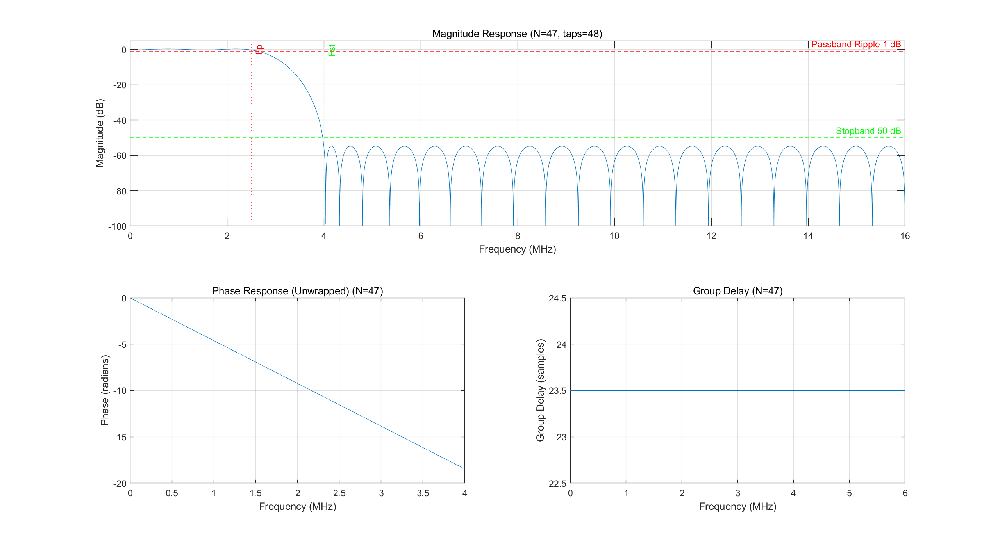
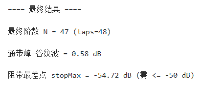

# 等波纹法（Parks–McClellan）FIR 滤波器设计- MATLAB实现

本仓库提供一个完整的 MATLAB 示例：使用 **等波纹法（Parks–McClellan）** 设计线性相位 FIR 低通滤波器。  
流程包含：`firpmord` 估算阶数 → `firpm` 设计系数 → 频响/群延迟分析 → **自动加阶迭代**直到满足阻带衰减指标。

## 功能概览

- 使用 `firpmord` 根据指标估算最小阶数
- 使用 `firpm`（Parks–McClellan）生成等波纹 FIR 系数
- 迭代增加阶数（step 可调），直到阻带满足 `Ast`
- 输出与展示：
  - 幅频响应（dB）
  - 相频响应（解包裹）
  - 群延迟（Group Delay）
- 在命令行打印最终性能指标（通带纹波、阻带最差点等）

## 运行环境

- MATLAB（建议 R2018b 及以上）
- Signal Processing Toolbox（需要 `firpmord` / `firpm` / `freqz` / `grpdelay`）

## 快速开始

1. 克隆仓库或下载源码：
   ```bash
   git clone https://github.com/LiMingKuan-UESTC/Firpm-Equiripple-Demo.git
   cd Firpm-Equiripple-Demo
2. 用 MATLAB 打开工程根目录（或将根目录加入路径）。

3. 运行脚本（后缀为.mlx的文件为实时脚本）：
   ```matlab
   run('src/Firpm_Equiripple.m')
   ```
运行后会展示幅频、相频响应和群延时的仿真图，并在命令行输出每次迭代结果与最终指标。

## 参数说明

脚本中可调参数示例（代码中已按下表准备了示例值）：

| 参数        | 含义              | 示例值     |
| --------- | --------------- | ------- |
| `fs`      | 采样率             | `32e6`  |
| `fp`      | 通带截止频率          | `2.5e6` |
| `fst`     | 阻带起始频率          | `4.0e6` |
| `Ap`      | 通带最大衰减 / 波纹（dB） | `1`     |
| `Ast`     | 阻带最小衰减（dB）      | `50`    |
| `step`    | 每次加阶步长          | `10`    |
| `maxIter` | 最大迭代次数          | `40`    |
| `nFFT`    | 频率采样点数          | `16384` |

## 输出说明

### 1）图像窗口（示例）

* 幅频响应（dB）：标注 `Fp`、`Fst`、`Ap`、`Ast` 参考线
* 相频响应：`unwrap(angle(H))`
* 群延迟：`grpdelay`



### 2）命令行输出（示例）

* `firpmord` 估算阶数 `N`
* 每次尝试的 `stopMax`（阻带最差点）与 `passRipple`（通带峰谷纹波）
* 满足指标后输出最终 `N` 与 `taps`



## 仓库结构

```text
.
├── README.md
├── LICENSE
├── src
│   ├── Firpm_Equiripple.m
│   └── Firpm-Equiripple.mlx
└── figures
    ├── figure1.png
    └── figure2.png
```

## 📜 使用说明

本项目由 **LiMingKuan-UESTC** 制作，仅供交流、学习和展示使用。

作者不保证本项目的可靠性、稳定性、完整性或适用性。因使用本项目所产生的任何问题、损失或风险，均由使用者自行承担。

如使用、修改、分发或引用本项目及其源代码，请明确注明原项目出处与作者信息：

- 作者：LiMingKuan-UESTC
- 仓库地址：https://github.com/LiMingKuan-UESTC/Firpm-Equiripple-Demo

## 常见问题

### Q：阻带达不到 Ast 怎么办？

* 增大 `step` 或 `maxIter`
* 提高 `nFFT` 以更精细评估阻带最差点
* 或放宽指标（例如增大过渡带：提高 `fst` 或降低 `fp`）


